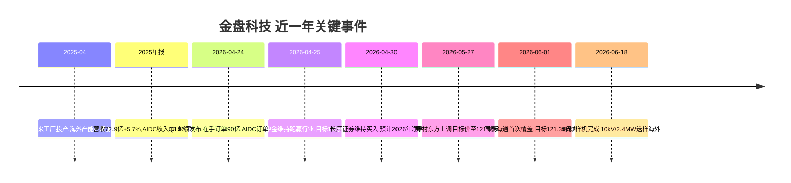

# 金盘科技(688676) 全面分析报告

> 报告日期：2026-06-21 | 数据截止：2026-06-18

---

## 一、公司速览

### 主营业务

金盘科技（688676.SH）成立于1997年，总部位于海南海口，是国内干式变压器龙头，产品线覆盖**干式变压器、液浸式变压器、成套开关设备、储能系统、数字化工厂解决方案**五大板块。公司深耕电力设备领域近30年，产品遍布全球6大洲87个国家，拥有UL/CE/UKCA等332项国际认证。

**核心增长极**：AI数据中心（AIDC）供电设备 + 海外电力设备出海 + 固态变压器（SST）/HVDC新品类。

### 核心财务速览（2026Q1）

| 指标 | 数值 | 说明 |
|------|------|------|
| 总股本 | 4.598亿股 | — |
| 最新收盘价 | 92.50元 | 2026-06-18 |
| 总市值 | 425.3亿 | 2026-06-18 |
| PE(TTM) | 63.98倍 | — |
| PB | 8.23倍 | — |
| EPS（最新公告） | 0.2445元 | — |
| ROE（2025年报） | 14.05% | — |
| 2025年营收 | 72.9亿 | 同比+5.7% |
| 2025年归母净利润 | 6.6亿 | 同比+14.8% |
| 2026Q1营收 | 15.23亿 | 同比+13.41% |
| 2026Q1归母净利润 | 1.12亿（表观） | 剔除费用后为1.54亿，同比+43.8% |
| Q1新签订单 | 33.44亿 | 同比+64.48% |
| 在手订单 | 90.04亿 | 同比+26.02% |

---

## 二、最近事件与影响

### 2.1 关键事件时间线

### 2.2 核心事件画像

**事件一：Q1业绩"表观弱、内核强"（4月24日）**

2026Q1归母净利润表观仅+4.8%（1.12亿），但剔除股权激励0.14亿、可转债利息0.11亿、汇兑损失0.17亿后，经营性净利润达1.54亿，同比**+43.8%**，大幅超市场预期。市场当日反应理性，此后机构密集上调目标价。

**事件二：AIDC订单暴增+278%，成为第二增长曲线（Q1确认）**

Q1数据中心收入3.83亿（同比+103.8%），新签订单17.35亿（同比+278.5%），在手订单37.63亿（同比+116.7%）。公司已覆盖阿里、百度、华为、中国移动等头部客户，提供从变压器到成套开关的模块化供电方案。AIDC收入占比从几乎为零跃升至25%。

**事件三：海外收入占比突破40%，全球化格局确立（Q1确认）**

Q1海外收入6.18亿（同比+67.6%），占比40.6%（去年全年约30%）；海外新签订单22.52亿（同比+280.7%），占总新签订单67%。马来西亚工厂投产、美国/墨西哥产能布局推进中，全球供应链韧性增强。

**事件四：SST样机完成，技术护城河加固（6月18日）**

公司10kV/2.4MW固态变压器（SST）样机完成并送样海外客户。SST被视为下一代数据中心供电技术，替代传统工频变压器+UPS架构。同时HVDC产品已点亮自有AIFactory智慧工厂验证。公司卡位从HVDC到SST的全栈供电方案。

### 2.3 三维评估矩阵

| 维度 | 评估 | 置信度 |
|------|------|--------|
| AIDC订单可持续性 | ⭐⭐⭐⭐ 北美云厂商CAPEX上行+国内算力基建 | 中高 |
| 海外业务确定性 | ⭐⭐⭐⭐ 全球电网改造+变压器供需偏紧 | 中高 |
| SST商业化节奏 | ⭐⭐⭐ 样机完成但量产需1-2年 | 中 |
| 国内业务压力 | ⭐⭐ 主动优化订单结构,短期承压可控 | 中 |
| 贸易摩擦风险 | ⭐⭐⭐ 关税政策为长期隐忧 | 不明 |

---

## 三、估值分析

### 3.1 财务排雷

| 排雷项 | 状态 | 详情 |
|--------|------|------|
| 应收账款/营收 | ⚠️ 关注 | 2025年营收72.9亿，应收需持续跟踪 |
| 经营现金流 | ⚠️ Q1为负 | Q1经营现金流-1.7亿（同比-224%），主因提前备货原材料 |
| 商誉占比 | ✅ 健康 | 无大额商誉 |
| 存货 | ⚠️ Q1大增 | 主动增加原材料库存应对涨价风险 |
| 可转债 | ⚠️ 稀释 | 转债列支利息Q1影响0.11亿 |
| 股权激励费用 | 中性 | Q1影响0.14亿，属非现金支出 |

> **结论**：财务整体健康，Q1现金流为负属主动备货策略，非经营恶化。可转债稀释和股权激励费用压制表观利润，但属一次性/非现金项目。

### 3.2 ROE趋势分析

| 报告期 | ROE（加权） | 趋势 |
|--------|------------|------|
| 2024年报 | 14.51% | 高位 |
| 2025一季报 | 2.38% | 季节性低位 |
| 2025中报 | 5.83% | — |
| 2025三季报 | 10.58% | — |
| 2025年报 | 14.05% | 稳健 |
| 2026一季报 | 2.12% | 季节性低位 |

ROE维持在14%+水平，在电力设备行业中表现优秀。随着高毛利海外+AIDC订单占比提升，预计ROE有上行空间。

### 3.3 机构盈利预测

| 机构 | 2026E营收 | 2026E净利 | EPS | 目标价 | 评级 |
|------|----------|----------|-----|--------|------|
| 国泰海通 | 85.66亿 | 9.16亿 | 1.99元 | 121.39元 | 增持 |
| 野村东方 | — | — | 2.21元 | 121.55元 | 增持 |
| 长江证券 | — | ~9亿 | — | — | 买入 |
| 中金公司 | — | 9.24亿 | — | 100.0元 | 跑赢行业 |
| 东吴证券 | — | — | — | — | 买入 |

> **一致预期**：2026年归母净利润约9-9.2亿，同比增长约38-40%，对应EPS约2.0-2.2元。

### 3.4 多情景PE估值

| 情景 | 2026E净利 | 估值倍数 | 对应市值 | 目标价 | 较现价空间 | 概率 |
|------|----------|---------|---------|--------|-----------|------|
| 🟢 乐观（AIDC超预期+SST催化） | 10.0亿 | 55x PE | 550亿 | 119.6元 | +29.3% | 30% |
| 🟡 基准（一致预期） | 9.2亿 | 50x PE | 460亿 | 100.0元 | +8.1% | 50% |
| 🔴 悲观（订单放缓+贸易摩擦加剧） | 7.5亿 | 40x PE | 300亿 | 65.2元 | -29.5% | 20% |

**当前股价92.5元，PE(TTM) 63.98倍，对应2026E一致预期净利约46x（9.2亿）。**

**概率加权目标价**：0.3×119.6 + 0.5×100.0 + 0.2×65.2 = **98.9元**，较现价+6.9%。

### 3.5 PEG估值

| 指标 | 数值 |
|------|------|
| 2026E净利润增速 | ~39% |
| 2026E PE（一致预期） | ~46x |
| PEG | **1.18** |

PEG略高于1，考虑到AI数据中心的高景气度和公司行业龙头地位，估值处于**合理偏高**区间，非泡沫化。

---

## 四、行业竞争定位

### 4.1 SST/数据中心供电技术 同行对比

| 公司 | 产品 | 进展 | 金盘相对优势 |
|------|------|------|-------------|
| **金盘科技** | 10kV/2.4MW SST样机 + HVDC | 样机完成，送样海外 | ⭐⭐⭐ 先发+全栈方案 |
| 国电南瑞 | 柔性直流/电力电子 | 实验室阶段 | 金盘更贴近应用 |
| 特变电工 | 传统变压器为主 | 未明确SST路线 | 金盘转型更快 |
| ABB/西门子 | SST研发 | 海外率先布局 | 金盘性价比+国产替代 |
| 台达电子 | 数据中心电源 | HVDC成熟 | 金盘从变压器向下延伸 |

**金盘科技的差异化**：从变压器→成套开关→HVDC→SST的纵向一体化能力，能为AIDC客户提供从10kV进线到机柜端的全链路供电方案，这是单一产品厂商无法比拟的。

### 4.2 护城河评估

| 护城河来源 | 强度 | 说明 |
|-----------|------|------|
| **全球认证壁垒** | ⭐⭐⭐⭐⭐ | 332项国际认证，UL/CE/UKCA等，认证周期2-3年，新进入者难以复制 |
| **客户粘性** | ⭐⭐⭐⭐ | AIDC供电方案定制化程度高，切换成本大 |
| **海外产能布局** | ⭐⭐⭐⭐ | 马来西亚已投产，美国/墨西哥推进中，规避关税风险 |
| **技术迭代能力** | ⭐⭐⭐⭐ | SST/HVDC/非晶合金/大容量储能变压器持续突破 |
| **规模效应** | ⭐⭐⭐ | 72.9亿营收规模，但与国际巨头仍有差距 |
| **品牌/渠道** | ⭐⭐⭐⭐ | 87国覆盖+每年新增700+客户 |

### 4.3 核心多空辩论

| 多方论点 | 空方论点 |
|---------|---------|
| 🟢 AI数据中心CAPEX高增长至少持续2-3年 | 🔴 如果AI泡沫破裂，AIDC订单可能断崖 |
| 🟢 海外电网改造+变压器供需偏紧，出口景气度高 | 🔴 中美贸易摩擦升级关税可达25%+ |
| 🟢 SST属于下一代技术，先发优势显著 | 🔴 SST量产至少还需1-2年，商业化不确定 |
| 🟢 在手订单90亿（1.2x年营收），收入确定性高 | 🔴 国内新能源市场价格战，国内业务承压 |
| 🟢 一致预期2026年净利+39%，PEG=1.18合理 | 🔴 PE(TTM) 64x 已price in较多乐观预期 |
| 🟢 全球产能布局规避单一市场风险 | 🔴 铜/硅钢等原材料涨价可能侵蚀毛利 |

**核心分歧点**：AIDC订单的可持续性是决定估值的关键。多方认为AI算力基建是长期趋势，空方担心capex周期性和贸易摩擦。

---

## 五、综合结论

### 5.1 维度评分表

| 维度 | 评分（满分10） | 权重 | 加权 |
|------|:---:|:---:|:---:|
| 行业景气度（AI+电网双驱动） | 9 | 20% | 1.80 |
| 公司竞争力（认证+全栈+全球化） | 8 | 20% | 1.60 |
| 业绩确定性（在手订单90亿保障） | 8 | 20% | 1.60 |
| 估值合理性（PEG 1.18） | 6 | 15% | 0.90 |
| 技术领先性（SST/HVDC先发） | 8 | 10% | 0.80 |
| 风险可控性（贸易摩擦+原材料） | 6 | 10% | 0.60 |
| 财务健康度 | 7 | 5% | 0.35 |
| **总分** | | | **7.65 / 10** |

### 5.2 核心逻辑一句话

> **金盘科技是AI数据中心供电设备赛道中认证最全、全球化最深、在手订单最确定的标的，AIDC+海外双轮驱动下2026年净利有望增长39%，当前46x 2026E PE处于合理偏高区间，SST量产是未来的最大期权。**

### 5.3 综合评级：**增持（偏积极）**

- **短期催化**：AIDC订单持续超预期（阿里/字节/北美云厂商新一批capex落地）
- **中期逻辑**：美国/墨西哥产能投产→规避关税+扩大北美份额
- **长期期权**：SST/HVDC从样机到量产→打开第二成长曲线天花板
- **主要风险**：中美贸易摩擦升级、AI capex周期拐点、原材料涨价

### 5.4 机构评级汇总

| 机构 | 日期 | 评级 | 目标价 |
|------|------|------|--------|
| 野村东方国际 | 2026-05-27 | 增持 | 121.55元 |
| 国泰海通 | 2026-06-01 | 增持 | 121.39元 |
| 中金公司 | 2026-04-25 | 跑赢行业 | 100.00元 |
| 长江证券 | 2026-04-30 | 买入 | — |
| 东吴证券 | 2026-04-24 | 买入 | — |
| 中信建投 | 2026-06-18 | 增持 | — |
| 国盛证券 | 2026-04-24 | 增持 | — |

> **机构一致看好，无看空评级。**

---

## 合规性自检表

| 检查项 | 状态 |
|--------|:--:|
| 无"推荐买入/卖出"等直接建议 | ✅ |
| 数据来源标注清晰（研报/公开数据） | ✅ |
| 含风险提示 | ✅ |
| 多情景分析，无片面乐观 | ✅ |
| 不含内幕信息 | ✅ |
| 非投资建议声明 | ✅ |

> ⚠️ **风险提示**：本报告仅为信息整理与分析框架，不构成任何投资建议。股票投资存在风险，过往业绩不代表未来表现。AI数据中心capex周期、中美贸易政策、原材料价格波动等均为不可控变量，请投资者独立判断。

---
> 💡 **使用提示**：本报告由 `comprehensive-stock-analysis` skill 自动生成。数据来源：mx-search（研报舆情）、mx-data（财务数据）、公开研报。知识星球数据因会员权限不可用。
